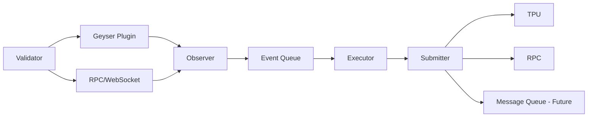

# Networking and Events

## Overview

Antegen's networking and event architecture forms the backbone of its real-time automation capabilities. This document details the event pipeline from validator-level data capture through to thread execution, including network protocols, message queuing, and performance optimizations.

## Event Pipeline Architecture

### End-to-End Event Flow



### Event Types

```rust
#[derive(Clone, Debug, Serialize, Deserialize)]
pub enum ObservedEvent {
    // Clock events drive time-based triggers
    ClockUpdate {
        clock: Clock,
        slot: u64,
        block_height: u64,
    },

    // Thread events track state changes
    ThreadUpdate {
        thread: Thread,
        pubkey: Pubkey,
        slot: u64,
    },

    // Account events monitor data changes
    AccountUpdate {
        pubkey: Pubkey,
        data_hash: u64,
        slot: u64,
        write_version: u64,
    },

    // Slot events for blockchain milestones
    SlotUpdate {
        slot: u64,
        parent: Option<u64>,
        status: SlotStatus,
    },
}
```

## Network Protocols

### RPC Communication

#### Standard RPC Methods

```rust
pub struct RpcEventSource {
    client: Arc<RpcClient>,
    config: RpcConfig,
}

impl RpcEventSource {
    pub async fn poll_threads(&self) -> Result<Vec<Thread>> {
        // Fetch all thread accounts
        let accounts = self.client
            .get_program_accounts_with_config(
                &thread_program::ID,
                RpcProgramAccountsConfig {
                    filters: Some(vec![
                        RpcFilterType::DataSize(THREAD_SIZE),
                    ]),
                    account_config: RpcAccountInfoConfig {
                        encoding: Some(UiAccountEncoding::Base64),
                        commitment: Some(CommitmentConfig::confirmed()),
                        ..Default::default()
                    },
                    ..Default::default()
                },
            )
            .await?;

        // Deserialize thread accounts
        accounts.into_iter()
            .filter_map(|(pubkey, account)| {
                Thread::try_deserialize(&mut &account.data[8..])
                    .ok()
                    .map(|thread| (pubkey, thread))
            })
            .collect()
    }

    pub async fn get_clock(&self) -> Result<Clock> {
        self.client
            .get_account(&sysvar::clock::ID)
            .await?
            .map(|account| {
                Clock::from_account_info(&account)
            })
            .ok_or_else(|| anyhow!("Clock sysvar not found"))
    }
}
```

#### RPC Configuration

```rust
pub struct RpcConfig {
    pub url: String,
    pub commitment: CommitmentConfig,
    pub timeout: Duration,
    pub max_retries: u32,
    pub rate_limit: Option<RateLimit>,
}

pub struct RateLimit {
    pub requests_per_second: u32,
    pub burst_size: u32,
}
```

### WebSocket Subscriptions

#### Real-time Updates via WebSocket

```rust
pub struct WebSocketEventSource {
    pubsub_client: Arc<PubsubClient>,
    subscriptions: Arc<RwLock<HashMap<Pubkey, SubscriptionId>>>,
}

impl WebSocketEventSource {
    pub async fn subscribe_thread(&self, thread: Pubkey) -> Result<()> {
        let sub_id = self.pubsub_client
            .account_subscribe(
                &thread,
                Some(RpcAccountInfoConfig {
                    encoding: Some(UiAccountEncoding::Base64),
                    commitment: Some(CommitmentConfig::confirmed()),
                    ..Default::default()
                }),
            )
            .await?;

        self.subscriptions.write().await
            .insert(thread, sub_id);

        Ok(())
    }

    pub async fn process_updates(&mut self) -> Result<()> {
        let (mut stream, _unsub) = self.pubsub_client
            .slot_updates_subscribe()
            .await?;

        while let Some(update) = stream.next().await {
            match update {
                SlotUpdate::Confirmed { slot, .. } => {
                    self.handle_slot_update(slot).await?;
                },
                SlotUpdate::Rooted { slot, .. } => {
                    self.handle_finalized_slot(slot).await?;
                },
                _ => {}
            }
        }

        Ok(())
    }
}
```

### TPU Direct Submission

#### TPU Connection Management

```rust
pub struct TpuClient {
    connection_cache: Arc<ConnectionCache>,
    leader_schedule: Arc<RwLock<LeaderSchedule>>,
    config: TpuConfig,
}

impl TpuClient {
    pub async fn send_transaction(&self, tx: &Transaction) -> Result<()> {
        // Get current leader
        let leader = self.get_current_leader().await?;

        // Get TPU connection
        let conn = self.connection_cache
            .get_connection(&leader.tpu_addr)?;

        // Send transaction directly
        conn.send_data(&bincode::serialize(tx)?).await?;

        // Optional: Send to next few leaders
        if self.config.send_to_future_leaders {
            for future_leader in self.get_future_leaders(3).await? {
                let conn = self.connection_cache
                    .get_connection(&future_leader.tpu_addr)?;
                conn.send_data(&bincode::serialize(tx)?).await?;
            }
        }

        Ok(())
    }

    async fn get_current_leader(&self) -> Result<Leader> {
        let schedule = self.leader_schedule.read().await;
        let current_slot = self.get_slot().await?;

        schedule
            .get_leader_at_slot(current_slot)
            .ok_or_else(|| anyhow!("No leader for current slot"))
    }
}

pub struct TpuConfig {
    pub fanout_size: usize,
    pub send_to_future_leaders: bool,
    pub connection_pool_size: usize,
    pub retry_timeout: Duration,
}
```

## Message Queue Architecture (Future Implementation)

### Planned Message Queue Integration

Antegen is designed to support message queue integration for reliable event distribution and transaction replay. This capability is not yet implemented but the architecture supports it.

#### Proposed Message Queue Interface

```rust
// TODO: Implement message queue abstraction
// This interface will support various backends like NATS, Kafka, Redis, etc.
pub trait MessageQueue: Send + Sync {
    async fn initialize(&self) -> Result<()>;
    async fn publish(&self, topic: &str, payload: &[u8]) -> Result<()>;
    async fn subscribe(&self, topic: &str) -> Result<MessageSubscription>;
    async fn acknowledge(&self, message_id: &str) -> Result<()>;
}

// Example implementation for future NATS integration
// pub struct NatsMessageQueue {
//     client: async_nats::Client,
//     config: MessageQueueConfig,
// }

// Example topics for event distribution:
// - "antegen.events.clock" - Clock updates
// - "antegen.events.thread" - Thread state changes
// - "antegen.events.account" - Account updates
// - "antegen.durable_txs" - Failed transactions for replay
            .publish(subject, payload.into())
            .await?
            .await?; // Wait for acknowledgment

        Ok(())
    }
}

pub struct NatsConfig {
    pub url: String,
    pub cluster_name: Option<String>,
    pub credentials: Option<String>,
    pub tls_config: Option<TlsConfig>,
}
```

#### Consumer Patterns

```rust
pub struct EventConsumer {
    consumer: PullConsumer,
    processor: Arc<dyn EventProcessor>,
}

#[async_trait]
impl EventConsumer {
    pub async fn consume(&mut self) -> Result<()> {
        let mut messages = self.consumer
            .messages()
            .await?;

        while let Some(msg) = messages.next().await {
            let msg = msg?;

            // Process message
            match self.process_message(&msg).await {
                Ok(_) => {
                    msg.ack().await?;
                },
                Err(e) if self.should_retry(&e) => {
                    // Let message be redelivered
                    msg.nak().await?;
                },
                Err(e) => {
                    // Terminal failure
                    msg.term().await?;
                    error!("Failed to process message: {}", e);
                }
            }
        }

        Ok(())
    }

    async fn process_message(&self, msg: &Message) -> Result<()> {
        let event: ObservedEvent = serde_json::from_slice(&msg.payload)?;
        self.processor.handle_event(event).await
    }
}
```

## Geyser Plugin Event Streaming

### Direct Validator Integration

```rust
pub struct GeyserPluginEventSource {
    receiver: Receiver<ObservedEvent>,
    buffer: VecDeque<ObservedEvent>,
    config: GeyserConfig,
}

impl GeyserPluginEventSource {
    pub fn new(receiver: Receiver<ObservedEvent>) -> Self {
        Self {
            receiver,
            buffer: VecDeque::with_capacity(1000),
            config: GeyserConfig::default(),
        }
    }

    pub async fn next_batch(&mut self) -> Vec<ObservedEvent> {
        // Drain existing buffer first
        let mut batch = Vec::with_capacity(self.config.batch_size);

        while batch.len() < self.config.batch_size {
            if let Some(event) = self.buffer.pop_front() {
                batch.push(event);
            } else {
                break;
            }
        }

        // Try to receive more events without blocking
        let deadline = Instant::now() + self.config.batch_timeout;
        while batch.len() < self.config.batch_size &&
              Instant::now() < deadline {
            match self.receiver.try_recv() {
                Ok(event) => batch.push(event),
                Err(TryRecvError::Empty) => {
                    // Brief sleep to avoid busy waiting
                    tokio::time::sleep(Duration::from_micros(100)).await;
                },
                Err(TryRecvError::Disconnected) => break,
            }
        }

        batch
    }
}

pub struct GeyserConfig {
    pub batch_size: usize,
    pub batch_timeout: Duration,
    pub buffer_size: usize,
}
```

### Account Update Filtering

```rust
pub struct AccountFilter {
    patterns: Vec<FilterPattern>,
    cache: Arc<RwLock<LruCache<Pubkey, bool>>>,
}

pub enum FilterPattern {
    ProgramOwned(Pubkey),
    AccountList(HashSet<Pubkey>),
    DataPattern { offset: usize, pattern: Vec<u8> },
}

impl AccountFilter {
    pub async fn should_process(&self, account: &AccountInfo) -> bool {
        // Check cache first
        if let Some(cached) = self.cache.read().await.get(&account.pubkey) {
            return *cached;
        }

        // Evaluate patterns
        let result = self.patterns.iter().any(|pattern| {
            match pattern {
                FilterPattern::ProgramOwned(program) => {
                    account.owner == *program
                },
                FilterPattern::AccountList(list) => {
                    list.contains(&account.pubkey)
                },
                FilterPattern::DataPattern { offset, pattern } => {
                    account.data.len() >= offset + pattern.len() &&
                    &account.data[*offset..*offset + pattern.len()] == pattern
                },
            }
        });

        // Update cache
        self.cache.write().await.put(account.pubkey, result);

        result
    }
}
```

## Performance Optimization

### Connection Pooling

```rust
pub struct ConnectionPool {
    connections: Arc<RwLock<HashMap<SocketAddr, Connection>>>,
    config: PoolConfig,
}

impl ConnectionPool {
    pub async fn get_connection(&self, addr: &SocketAddr) -> Result<Connection> {
        // Try to get existing connection
        if let Some(conn) = self.connections.read().await.get(addr) {
            if conn.is_alive() {
                return Ok(conn.clone());
            }
        }

        // Create new connection
        let conn = self.create_connection(addr).await?;

        // Store in pool
        self.connections.write().await
            .insert(*addr, conn.clone());

        // Start health check task
        self.spawn_health_check(addr.clone());

        Ok(conn)
    }

    async fn create_connection(&self, addr: &SocketAddr) -> Result<Connection> {
        let socket = TcpStream::connect_timeout(
            addr,
            self.config.connect_timeout
        ).await?;

        socket.set_nodelay(true)?;
        socket.set_keepalive(Some(self.config.keepalive))?;

        Ok(Connection::new(socket))
    }

    fn spawn_health_check(&self, addr: SocketAddr) {
        let connections = self.connections.clone();
        let interval = self.config.health_check_interval;

        tokio::spawn(async move {
            loop {
                tokio::time::sleep(interval).await;

                let mut conns = connections.write().await;
                if let Some(conn) = conns.get(&addr) {
                    if !conn.is_alive() {
                        conns.remove(&addr);
                        break;
                    }
                }
            }
        });
    }
}

pub struct PoolConfig {
    pub max_connections: usize,
    pub connect_timeout: Duration,
    pub keepalive: Duration,
    pub health_check_interval: Duration,
}
```

### Event Batching

```rust
pub struct EventBatcher {
    buffer: Vec<ObservedEvent>,
    config: BatchConfig,
    last_flush: Instant,
}

impl EventBatcher {
    pub fn add_event(&mut self, event: ObservedEvent) -> Option<Vec<ObservedEvent>> {
        self.buffer.push(event);

        // Check if we should flush
        if self.should_flush() {
            Some(self.flush())
        } else {
            None
        }
    }

    fn should_flush(&self) -> bool {
        self.buffer.len() >= self.config.max_batch_size ||
        self.last_flush.elapsed() >= self.config.max_wait_time
    }

    fn flush(&mut self) -> Vec<ObservedEvent> {
        self.last_flush = Instant::now();
        std::mem::take(&mut self.buffer)
    }
}

pub struct BatchConfig {
    pub max_batch_size: usize,
    pub max_wait_time: Duration,
}
```

### Caching Strategies

```rust
pub struct EventCache {
    thread_cache: Arc<RwLock<LruCache<Pubkey, Thread>>>,
    clock_cache: Arc<RwLock<Clock>>,
    account_cache: Arc<RwLock<LruCache<Pubkey, AccountData>>>,
    config: CacheConfig,
}

impl EventCache {
    pub async fn get_thread(&self, pubkey: &Pubkey) -> Option<Thread> {
        // Try cache first
        if let Some(thread) = self.thread_cache.read().await.get(pubkey) {
            return Some(thread.clone());
        }

        // Cache miss - will need to fetch
        None
    }

    pub async fn update_thread(&self, pubkey: Pubkey, thread: Thread) {
        self.thread_cache.write().await.put(pubkey, thread);
    }

    pub async fn get_clock(&self) -> Clock {
        self.clock_cache.read().await.clone()
    }

    pub async fn update_clock(&self, clock: Clock) {
        *self.clock_cache.write().await = clock;
    }

    pub async fn invalidate_account(&self, pubkey: &Pubkey) {
        self.account_cache.write().await.pop(pubkey);
    }
}

pub struct CacheConfig {
    pub thread_cache_size: usize,
    pub account_cache_size: usize,
    pub ttl: Duration,
}
```

## Network Resilience

### Automatic Failover

```rust
pub struct FailoverClient {
    endpoints: Vec<Endpoint>,
    current: AtomicUsize,
    health_checker: HealthChecker,
}

impl FailoverClient {
    pub async fn request<T>(&self, operation: impl Fn(&Endpoint) -> Future<Output = Result<T>>) -> Result<T> {
        let mut last_error = None;
        let mut attempts = 0;

        while attempts < self.endpoints.len() {
            let idx = self.current.load(Ordering::Relaxed) % self.endpoints.len();
            let endpoint = &self.endpoints[idx];

            if self.health_checker.is_healthy(endpoint).await {
                match operation(endpoint).await {
                    Ok(result) => return Ok(result),
                    Err(e) => {
                        last_error = Some(e);
                        self.health_checker.mark_unhealthy(endpoint).await;
                    }
                }
            }

            // Try next endpoint
            self.current.fetch_add(1, Ordering::Relaxed);
            attempts += 1;
        }

        Err(last_error.unwrap_or_else(|| anyhow!("All endpoints failed")))
    }
}
```

### Circuit Breaker for Network Calls

```rust
pub struct NetworkCircuitBreaker {
    state: Arc<RwLock<CircuitState>>,
    config: CircuitConfig,
    metrics: Arc<CircuitMetrics>,
}

impl NetworkCircuitBreaker {
    pub async fn call<T, F>(&self, f: F) -> Result<T>
    where
        F: Future<Output = Result<T>>,
    {
        // Check circuit state
        let state = self.state.read().await.clone();

        match state {
            CircuitState::Open(opened_at) => {
                if opened_at.elapsed() > self.config.reset_timeout {
                    // Try half-open
                    *self.state.write().await = CircuitState::HalfOpen;
                } else {
                    self.metrics.rejected.inc();
                    return Err(anyhow!("Circuit breaker is open"));
                }
            },
            CircuitState::HalfOpen => {
                // Allow one request through
            },
            CircuitState::Closed => {
                // Normal operation
            },
        }

        // Execute the call
        let start = Instant::now();
        match f.await {
            Ok(result) => {
                self.record_success(start.elapsed()).await;
                Ok(result)
            },
            Err(e) => {
                self.record_failure(start.elapsed()).await;
                Err(e)
            }
        }
    }

    async fn record_success(&self, duration: Duration) {
        self.metrics.success.inc();
        self.metrics.latency.observe(duration.as_secs_f64());

        let mut state = self.state.write().await;
        match *state {
            CircuitState::HalfOpen => {
                *state = CircuitState::Closed;
                self.metrics.state_changes.inc();
            },
            _ => {},
        }
    }

    async fn record_failure(&self, duration: Duration) {
        self.metrics.failure.inc();
        self.metrics.latency.observe(duration.as_secs_f64());

        let mut state = self.state.write().await;
        match *state {
            CircuitState::HalfOpen => {
                *state = CircuitState::Open(Instant::now());
                self.metrics.state_changes.inc();
            },
            CircuitState::Closed => {
                // Check failure threshold
                let failure_rate = self.calculate_failure_rate().await;
                if failure_rate > self.config.failure_threshold {
                    *state = CircuitState::Open(Instant::now());
                    self.metrics.state_changes.inc();
                }
            },
            _ => {},
        }
    }
}
```

## Event Processing Patterns

### Priority Queue Processing

```rust
pub struct PriorityEventQueue {
    queues: [VecDeque<ObservedEvent>; 4], // 4 priority levels
    stats: QueueStats,
}

impl PriorityEventQueue {
    pub fn enqueue(&mut self, event: ObservedEvent, priority: Priority) {
        let queue_idx = priority as usize;
        self.queues[queue_idx].push_back(event);
        self.stats.record_enqueue(priority);
    }

    pub fn dequeue(&mut self) -> Option<ObservedEvent> {
        // Process high priority first
        for (idx, queue) in self.queues.iter_mut().enumerate() {
            if let Some(event) = queue.pop_front() {
                self.stats.record_dequeue(Priority::from_index(idx));
                return Some(event);
            }
        }
        None
    }

    pub fn rebalance(&mut self) {
        // Prevent starvation of low priority events
        let total_events: usize = self.queues.iter()
            .map(|q| q.len())
            .sum();

        if total_events > 1000 {
            // Promote some low priority events
            for i in (1..4).rev() {
                if self.queues[i].len() > 100 {
                    if let Some(event) = self.queues[i].pop_front() {
                        self.queues[i - 1].push_back(event);
                    }
                }
            }
        }
    }
}

#[derive(Clone, Copy)]
pub enum Priority {
    Critical = 0,
    High = 1,
    Medium = 2,
    Low = 3,
}
```

### Event Deduplication

```rust
pub struct EventDeduplicator {
    seen: Arc<RwLock<HashSet<EventHash>>>,
    window: Duration,
    cleaner: JoinHandle<()>,
}

impl EventDeduplicator {
    pub fn new(window: Duration) -> Self {
        let seen = Arc::new(RwLock::new(HashSet::new()));
        let seen_clone = seen.clone();

        // Start cleaner task
        let cleaner = tokio::spawn(async move {
            let mut interval = tokio::time::interval(window);
            loop {
                interval.tick().await;
                seen_clone.write().await.clear();
            }
        });

        Self { seen, window, cleaner }
    }

    pub async fn is_duplicate(&self, event: &ObservedEvent) -> bool {
        let hash = self.hash_event(event);

        let mut seen = self.seen.write().await;
        !seen.insert(hash)
    }

    fn hash_event(&self, event: &ObservedEvent) -> EventHash {
        let mut hasher = DefaultHasher::new();

        match event {
            ObservedEvent::ThreadUpdate { thread, pubkey, .. } => {
                hasher.write(b"thread");
                hasher.write(pubkey.as_ref());
                hasher.write_u64(thread.exec_count);
            },
            ObservedEvent::ClockUpdate { clock, .. } => {
                hasher.write(b"clock");
                hasher.write_i64(clock.unix_timestamp);
            },
            // ... other event types
        }

        EventHash(hasher.finish())
    }
}
```

## Monitoring and Metrics

### Network Metrics Collection

```rust
pub struct NetworkMetrics {
    // Counters
    pub events_received: Counter,
    pub events_processed: Counter,
    pub events_dropped: Counter,

    // Gauges
    pub queue_depth: Gauge,
    pub active_connections: Gauge,
    pub cache_size: Gauge,

    // Histograms
    pub event_latency: Histogram,
    pub processing_time: Histogram,
    pub batch_size: Histogram,

    // Network specific
    pub bytes_received: Counter,
    pub bytes_sent: Counter,
    pub connection_errors: Counter,
    pub timeout_errors: Counter,
}

impl NetworkMetrics {
    pub fn record_event_received(&self, event_type: &str) {
        self.events_received
            .with_label_values(&[event_type])
            .inc();
    }

    pub fn record_processing_time(&self, duration: Duration, event_type: &str) {
        self.processing_time
            .with_label_values(&[event_type])
            .observe(duration.as_secs_f64());
    }

    pub fn update_queue_depth(&self, depth: usize) {
        self.queue_depth.set(depth as f64);
    }
}
```

### Network Health Monitoring

```rust
pub struct NetworkHealthMonitor {
    checks: Vec<Box<dyn NetworkCheck>>,
    status: Arc<RwLock<NetworkHealth>>,
}

#[async_trait]
pub trait NetworkCheck {
    async fn check(&self) -> CheckResult;
    fn name(&self) -> &str;
}

pub struct RpcHealthCheck {
    client: Arc<RpcClient>,
}

#[async_trait]
impl NetworkCheck for RpcHealthCheck {
    async fn check(&self) -> CheckResult {
        let start = Instant::now();

        match self.client.get_version().await {
            Ok(_) => CheckResult {
                healthy: true,
                latency: Some(start.elapsed()),
                message: "RPC responding normally".to_string(),
            },
            Err(e) => CheckResult {
                healthy: false,
                latency: None,
                message: format!("RPC error: {}", e),
            },
        }
    }

    fn name(&self) -> &str { "rpc_health" }
}
```

## Best Practices

### Event Source Selection

1. **Use Geyser for Validators**
   - Zero latency
   - Direct integration
   - No polling overhead

2. **Use WebSocket for Remote**
   - Real-time updates
   - Lower bandwidth than polling
   - Good for specific accounts

3. **Use RPC as Fallback**
   - Most compatible
   - Works everywhere
   - Higher latency

### Network Optimization

1. **Connection Management**
   - Pool connections
   - Implement keepalive
   - Monitor connection health

2. **Batching Strategy**
   - Batch similar operations
   - Balance latency vs throughput
   - Implement adaptive batching

3. **Caching Policy**
   - Cache frequently accessed data
   - Implement TTL appropriately
   - Monitor cache hit rates

### Error Handling

1. **Retry Logic**
   - Exponential backoff
   - Circuit breakers
   - Dead letter queues

2. **Failover Strategy**
   - Multiple endpoints
   - Health checks
   - Automatic switching

3. **Monitoring**
   - Track all network metrics
   - Alert on anomalies
   - Log failures comprehensively

## Conclusion

Antegen's networking and event architecture provides a robust, scalable foundation for real-time automation on Solana. Through its multi-layered approach combining Geyser plugins, WebSocket subscriptions, and RPC fallbacks, the system achieves both high performance and reliability. The integration of message queuing, connection pooling, and sophisticated error handling ensures that events are processed efficiently even under challenging network conditions. By following the patterns and best practices outlined in this document, operators can deploy Antegen with confidence in production environments requiring high throughput and low latency.