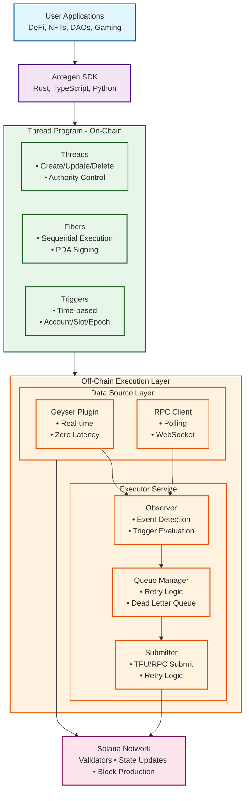
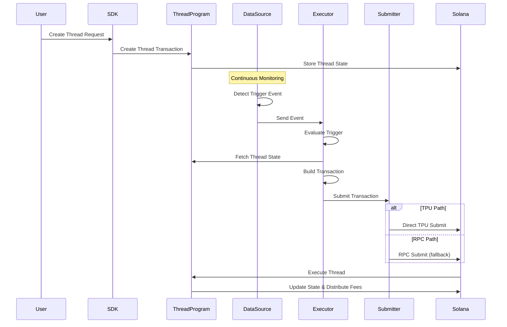

# Antegen Architecture Overview

## Introduction

Antegen is an event-driven automation engine for Solana that enables reliable, scheduled transaction execution. Built as a hard fork from Clockwork, Antegen provides a robust infrastructure for automating on-chain operations through a combination of on-chain programs and off-chain services.

## System Philosophy

### Core Principles

1. **Event-Driven Architecture**: All operations are triggered by blockchain events rather than polling
2. **Reliability First**: Multiple layers of redundancy ensure transaction execution
3. **Minimal Latency**: Direct validator integration eliminates polling delays
4. **Decentralized Execution**: Anyone can run an executor to process threads
5. **Economic Incentives**: Fee structure encourages timely execution

### Design Goals

- **Scalability**: Handle thousands of concurrent thread executions
- **Flexibility**: Support diverse automation patterns and triggers
- **Composability**: Integrate seamlessly with existing Solana programs
- **Resilience**: Recover gracefully from network issues and failures

## High-Level Architecture



### Component Flow Diagram



## Core Components

### 1. Thread Program (On-Chain)

The heart of Antegen - a Solana program that manages automated transaction execution.

**Key Responsibilities:**

- Thread lifecycle management (create, update, delete)
- Fiber (instruction) storage and sequencing
- Trigger condition validation
- Execution authorization and verification
- Fee collection and distribution
- State consistency enforcement

**Key Concepts:**

- **Thread**: An automation unit containing instructions and trigger conditions
- **Fiber**: Individual instruction within a thread (supports multiple)
- **Trigger**: Condition that initiates thread execution
- **Authority**: Account that controls the thread

### 2. Executor Service

The unified execution engine that combines observation, processing, and submission.

**Key Responsibilities:**

- **Event Observation** (integrated Observer):
  - Monitor blockchain state via data sources
  - Detect and evaluate trigger conditions
  - Filter threads based on readiness
  - Maintain thread state cache

- **Queue Management**:
  - Process execution events
  - Implement retry logic with exponential backoff
  - Manage dead letter queue for failures
  - Track execution status and metrics

- **Transaction Submission** (integrated Submitter):
  - Build and sign transactions
  - Submit via TPU/RPC
  - Handle durable transaction replay
  - Manage connection pools

**Execution Flow:**
1. Receive events from data sources
2. Evaluate trigger conditions
3. Queue ready threads for execution
4. Build transaction with fibers
5. Sign with executor keypair
6. Submit via appropriate strategy
7. Track confirmation and retry if needed

### 3. Data Source Layer

Pluggable event sources that feed the Executor with blockchain data.

**Available Data Sources:**

#### Geyser Plugin
- **Type**: Real-time push
- **Latency**: Near-zero (< 100ms)
- **Use Case**: Validator operators
- **Benefits**: Direct validator integration, no polling overhead

#### RPC Client
- **Type**: Pull-based polling/WebSocket
- **Latency**: 1-2 seconds
- **Use Case**: Standard deployments
- **Benefits**: Universal compatibility, easy setup

#### Custom Data Sources (Future)
- **Type**: Pluggable interface
- **Latency**: Implementation-dependent
- **Use Case**: Specialized deployments
- **Benefits**: Custom filtering, optimized for specific use cases

**Data Source Interface:**
```rust
pub trait DataSource {
    async fn next_event(&mut self) -> Result<Option<ObservedEvent>>;
    async fn start(&mut self) -> Result<()>;
    async fn stop(&mut self) -> Result<()>;
}
```

### 4. Submission Strategies

The Executor employs multiple strategies for transaction submission:

**Submission Modes:**
- **TPU Direct**: Lowest latency via validator TPU
- **RPC Standard**: Compatible fallback option
- **TPU + RPC**: Best of both worlds with automatic failover
- **Replay Service** (TODO): Durable replay for failed transactions

**Durability Features:**
- Nonce accounts for long-lived transactions
- Message queue for replay (implementation pending)
- Exponential backoff with jitter
- Circuit breaker patterns

## Data Flow

### Standard Execution Flow

```
1. User Creates Thread
   └─→ Thread Program stores thread state
   └─→ Authority, trigger, and fibers configured

2. Trigger Condition Met
   └─→ Clock update / Account change / Time reached
   └─→ Detected by active data source

3. Event Detection (Data Source Layer)
   ├─→ Geyser: Real-time push from validator
   └─→ RPC: Polling or WebSocket subscription

4. Event Processing (Executor Service)
   └─→ Observer component evaluates trigger
   └─→ Validates thread is ready and not paused
   └─→ Queues for execution

5. Transaction Building (Executor Service)
   └─→ Fetches thread state and fibers
   └─→ Builds transaction with sequential fibers
   └─→ Signs with executor keypair

6. Transaction Submission (Executor Service)
   └─→ Submitter component sends via TPU/RPC
   └─→ Monitors confirmation
   └─→ Retries with backoff if needed

7. Execution Complete
   └─→ Thread state updated on-chain
   └─→ Fees distributed (executor, core team, authority)
   └─→ Next trigger scheduled (if recurring)
```

### Failure Recovery Flow

```
1. Initial Submission Fails
   └─→ Submitter retries with exponential backoff

2. Multiple Failures
   └─→ Transaction queued for replay (when implemented)
   └─→ Durability layer engaged (pending implementation)

3. Replay Attempt (Future)
   └─→ Delay period expires
   └─→ Transaction replayed with fresh blockhash

4. Dead Letter Queue
   └─→ Max retries exceeded
   └─→ Transaction logged for manual intervention
```

## Deployment Topologies

### 1. Validator-Integrated (Recommended for Validators)

```
Validator Node
├── Solana Validator Process
├── Antegen Geyser Plugin (Data Source)
│   └── Real-time event stream
├── Executor Service
│   ├── Observer (event processing)
│   ├── Queue Manager (retry logic)
│   └── Submitter (TPU direct)
└── Direct TPU Access
```

**Advantages:**
- Minimal latency (< 100ms)
- Direct TPU access
- Reduced infrastructure
- Real-time event processing

### 2. Standalone RPC-Based

```
Separate Infrastructure
├── RPC Data Source
│   └── Polling/WebSocket Connection
└── Executor Service
    ├── Observer (event processing)
    ├── Queue Manager (Local DB)
    └── Submitter (RPC submission)
```

**Advantages:**
- No validator required
- Flexible deployment
- Cloud-friendly
- Easy horizontal scaling

### 3. Custom Data Source (Future)

```
Custom Infrastructure
├── Custom Data Source (e.g., Yellowstone, Carbon)
│   └── Optimized event detection
├── Executor Service
│   ├── Observer (custom filtering)
│   ├── Queue Manager (priority-based)
│   └── Submitter (multi-strategy)
└── Performance Stack
    ├── Cache Layer
    └── Metrics Collection
```

**Advantages:**
- Custom optimization
- Specialized filtering
- Performance tuning
- Resource efficiency

### 4. High Availability Multi-Region

```
Region 1 (Primary)
├── Geyser Plugin → Executor
├── Message Queue Leader (Future)
└── Primary TPU Connection

Region 2 (Secondary)
├── RPC Data Source → Executor
├── Message Queue Follower (Future)
└── Backup RPC Connection

Region 3 (Tertiary)
├── Custom Data Source → Executor (Future)
├── Message Queue Follower (Future)
└── Failover RPC Connection

Shared Infrastructure
├── Message Queue Cluster (Future)
├── Monitoring (Prometheus Federation)
└── Load Balancer (Geographic)
```

**Advantages:**
- Geographic redundancy
- Automatic failover
- Load distribution
- 99.99% uptime

## State Management

### On-Chain State

**Thread Account:**
```rust
pub struct Thread {
    pub authority: Pubkey,      // Thread owner
    pub id: String,             // Unique identifier
    pub paused: bool,           // Execution status
    pub trigger: Trigger,       // Execution condition
    pub nonce_account: Pubkey,  // Optional durability
    pub created_at: i64,        // Creation timestamp
    pub exec_count: u64,        // Execution counter
    pub rate_limit: u64,        // Min seconds between execs
}
```

**Fiber Account:**
```rust
pub struct Fiber {
    pub thread: Pubkey,         // Parent thread
    pub index: u8,              // Execution order
    pub instruction: Instruction, // Serialized instruction
    pub signer_seeds: Vec<Vec<Vec<u8>>>, // PDA seeds
    pub priority_fee: u64,      // Optional priority
}
```

### Off-Chain State

**Executor Queue (Local Storage):**
- Pending executions
- Retry queue with backoff
- Dead letter queue
- Execution history

**Observer Cache:**
- Active thread registry
- Trigger state tracking
- Clock synchronization
- Account change history

## Security Model

### Thread Security

1. **Authority Control**: Only thread authority can modify
2. **PDA Derivation**: Deterministic, collision-resistant addresses
3. **Instruction Validation**: All fibers validated before storage
4. **Signer Verification**: Proper authorization for all operations

### Executor Security

1. **Keypair Management**: Secure storage of executor keys
2. **Transaction Signing**: Local signing, never transmitted
3. **Fee Limits**: Bounded commission extraction
4. **Rate Limiting**: Prevents spam and abuse

### Network Security

1. **TLS/SSL**: Encrypted RPC/WebSocket connections
2. **Authentication**: Keypair-based authorization
3. **Input Validation**: Sanitization of all external data
4. **DoS Protection**: Rate limiting and circuit breakers

## Performance Characteristics

### Latency Metrics

- **Geyser Detection**: < 100ms from block production
- **RPC Detection**: 1-2 seconds (polling interval)
- **Execution Queue**: < 50ms processing time
- **TPU Submission**: 1-2 slots typical confirmation
- **End-to-end**: 2-5 seconds (Geyser), 3-8 seconds (RPC)

### Throughput Capabilities

- **Observer**: 10,000+ events/second
- **Executor**: 1,000+ threads/second (with parallelization)
- **Submitter**: 100+ TPS sustained
- **Geyser Plugin**: No practical limit (validator-bound)

### Resource Requirements

**Minimal Deployment:**
- CPU: 2 cores
- RAM: 4GB
- Storage: 10GB SSD
- Network: 100 Mbps

**Production Deployment:**
- CPU: 8+ cores
- RAM: 16GB+
- Storage: 100GB+ NVMe
- Network: 1 Gbps+

## Economic Model

### Fee Structure

```
Total Thread Fee
├── Executor Commission (configurable)
│   └── Incentivizes timely execution
├── Core Team Fee (protocol development)
│   └── Funds ongoing development
└── Thread Authority Remainder
    └── Pays for execution costs
```

### Commission Decay

Time-based commission reduction encourages prompt execution:

```
Commission Rate = Base Rate × Decay Factor

Where Decay Factor:
- 100% during grace period
- Linear decay to 0% over decay period
- 0% after decay period expires
```

## Monitoring and Observability

### Key Metrics

**System Health:**
- Thread execution rate
- Success/failure ratio
- Queue depths
- Latency percentiles

**Performance Metrics:**
- Events processed/second
- Transactions submitted/second
- Confirmation rate
- Resource utilization

**Economic Metrics:**
- Fees collected
- Commission earned
- Cost per execution
- Thread funding levels

### Logging Strategy

```
INFO:  High-level operations
DEBUG: Detailed execution flow
WARN:  Recoverable issues
ERROR: Failures requiring attention
```

### Integration Points

- **Prometheus**: Metrics collection
- **Grafana**: Visualization dashboards
- **Elasticsearch**: Log aggregation
- **PagerDuty**: Alert management

## Future Architecture Considerations

### Planned Enhancements

1. **Multi-Chain Support**: Cross-chain automation
2. **Advanced Scheduling**: Complex temporal patterns
3. **Conditional Logic**: If-then-else execution flows
4. **External Oracles**: Off-chain data integration
5. **Batch Operations**: Multiple threads in single transaction

### Scalability Roadmap

1. **Horizontal Scaling**: Distributed executor pools
2. **Sharding**: Thread partitioning across executors
3. **Caching Layer**: Redis/Memcached integration
4. **Event Streaming**: Kafka/Pulsar for high volume
5. **Global Distribution**: Multi-region deployments

## Conclusion

Antegen's architecture provides a robust foundation for automated transaction execution on Solana. By combining on-chain program logic with sophisticated off-chain services, the system achieves high reliability, low latency, and economic efficiency. The modular design allows for flexible deployment options while maintaining consistent behavior across different configurations.

The event-driven architecture, coupled with multiple layers of redundancy and failure recovery, ensures that automated transactions execute reliably even under adverse network conditions. As the Solana ecosystem evolves, Antegen's architecture is positioned to adapt and scale to meet growing automation demands.